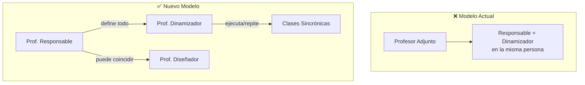

# Nuevo Modelo Docente Advance Online

📅 **Fecha:** 28-01-26

---

## 📌 Contexto

- El Decano ya conoce este modelo (presentado previamente por Vicerrector e Ignacio)
- **Alcance:** Todos los programas de pregrado Advance Online

---

## 👥 Estructura de Roles

### Roles que se mantienen
- Director
- Secretarios académicos

### Nuevos roles docentes

| Rol | Descripción |
|-----|-------------|
| **Profesor Responsable** | Profesor de cátedra. Lleva el curso, decide qué y cómo se enseña, vela por integridad y actualización de contenidos y evaluaciones |
| **Profesor Diseñador** | Diseña el curso |
| **Profesor Dinamizador** | Quien está frente a pantalla en clase sincrónica, en contacto con alumnos |

---

## 🎯 Cambio clave del modelo

### ⚠️ Punto importante

> El **Profesor Responsable** es el foco central del modelo, aunque el Dinamizador sea quien tiene contacto directo con los alumnos.

Los Dinamizadores son **"repetidores"** de lo que el Responsable define.

---

## 📊 Impacto del Profesor Responsable

El Prof. Responsable tiene un **impacto masivo** sobre todos los alumnos de todas las secciones bajo su cargo.

**Ejemplo:**
$$\text{Impacto} = 5 \text{ secciones} \times 60 \text{ alumnos} = 300 \text{ alumnos impactados}$$

---

## ⏱️ Modelo de horas

| Concepto | Horas |
|----------|-------|
| Horas en papel | 4 hrs |
| Horas prácticas (sincrónicas) | 1,5 hrs |

---

## ✅ Tareas y compromisos

- [ ] Transcribir explicación del fundamento del modelo desde la grabación
- [ ] **Javiera Jofré** se comprometió a enviar documentación del nuevo modelo

---

## 👤 Personas mencionadas

- **Javiera Jofré** — Explicó el fundamento del nuevo modelo
- **Vicerrector** — Presentó modelo al Decano
- **Ignacio** — Co-presentó modelo al Decano